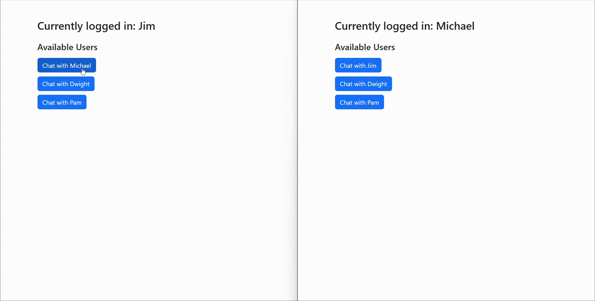

# Overview

This project consists of two main tasks:

1. Real-Time Chat Application: A bi-directional chat system that enables users to communicate via WebSockets. It supports file and image uploads, message persistence, and automatic message deletion.



2. Maze Shortest Distance Algorithm: An algorithm to compute the shortest path within a given maze represented as a 2D grid.

## Setup Instructions

### 1. Clone the repository:

```
https://github.com/samipthapa/chat-application-maze-solver.git
cd chat-application-maze-solver
```

### 2. Install the dependencies:
- Ensure you have Java (Spring Boot) installed.

### 3. Database Configuration:
- You can run PostgreSQL using Docker. The docker-compose.yml file is included for easy setup.
- To start PostgreSQL using Docker, run the following command:
``docker-compose up -d``
- This will start a PostgreSQL container. By default, it will be accessible at localhost:5432 with the database name `chat_app` and username `root` (you can adjust these settings in the docker-compose.yml file if necessary).
- For custom configurations, you can modify application.properties in your project

### 4. Run the application:
- Run the Spring Boot application using the following command:
```mvn spring-boot:run```